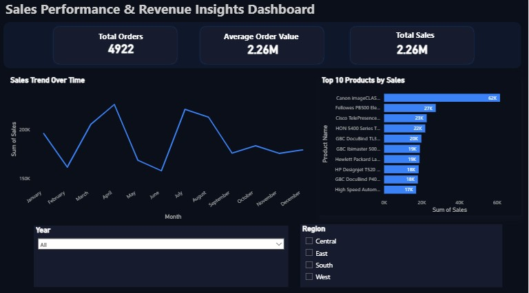

# Sales-Performance-Revenue-Insights-Dashboard
This project presents an interactive Power BI dashboard analyzing sales performance, revenue trends, and product-level insights.  The goal of this analysis is to identify seasonal sales patterns, top-performing products, and key revenue drivers to support business decision-making.

## Tools Used
- Power BI  
- Excel  
- Data Visualization  
- Business Analysis  

## Dashboard Preview

